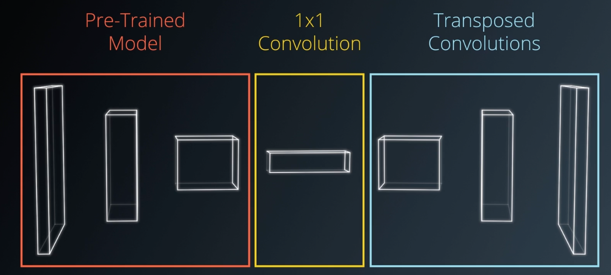
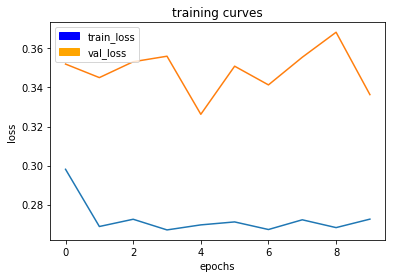

# Deep Learning Project: Follow Me

---

## [Rubric Points](https://review.udacity.com/#!/rubrics/1067/view) 
### Here I will consider the rubric points individually and describe how I addressed each point in my implementation.  

---

### 1. Provide a Writeup / README that includes all the rubric points and how you addressed each one.  You can submit your writeup as markdown or pdf.  

I wrote it in the format of a Jupyter Notebook as usual, then exported as a markdown file. I will explain each rubric point moving forward.

### 2. The Network Architecture.  

As the major task here for the network is to perform semantic segmentation, I decided to use a Fully Convolutional Networks. The basic structure is shown below.

There are 3 components of the network:



- The Encoder <br></br><br></br>
The encoder block has 3 convolutional layers. All of them are separable convolution layers, and their filter sizes increase with the depth of the network.  


```python
# ec layer 1
encoded_layer_1 = encoder_block(inputs, filters["ec1"], stride_ec)
    
# ec layer 2
encoded_layer_2 = encoder_block(encoded_layer_1, filters["ec2"], stride_ec)
    
# ec layer 3
encoded_layer_3 = encoder_block(encoded_layer_2, filters["ec3"], stride_ec)
```

- The 1x1 Convolution <br></br><br></br>
This block performs 1x1 convolution and batch normalization. So it's kernel and stride are set to 1 directly.


```python
conv_1by1_layer = conv2d_batchnorm(encoded_layer_3, filters["obo"], kernel_size=1, strides=1)
```

- The decoder <br></br><br></br>
The decoder block has 3 decode layers. For each of them, the first step is to perform a bilinear upsampling, with a factor for upsampling of 2, followed by a layer concatenation step. After that, 1 more separable convolution layer is added to provide some more spatial information. The decode layers are concatenated with the encode layers in a reversed sequence, as shown below.


```python
# dc layer 1
# concat with ec layer 3
decoded_layer_1 = decoder_block(conv_1by1_layer, encoded_layer_3, filters["dc1"])

# dc layer 2
# concat with ec layer 2
decoded_layer_2 = decoder_block(decoded_layer_1, encoded_layer_2, filters["dc2"])

# dc layer 3
# concat with ec layer 1
decoded_layer_3 = decoder_block(decoded_layer_2, encoded_layer_1, filters["dc3"])
```

In the above structure the filter sizes and stride size are defined as:


```python
filters = {
    "ec1": 16,
    "ec2": 32,
    "ec3": 64,
    "obo": 128,
    "dc1": 64,
    "dc2": 32,
    "dc3": 16
}

stride_ec = 1
```

The filter sizes for the encoder block is a recommended one in previous deep learning labs, and the decoder block just uses filter sizes that match them.

### 3. Training the Network

I was using the data provided in the project to train my network.

**Hyperparameters** <br></br>

Define the hyperparameters.
- **batch_size**: number of training samples/images that get propagated through the network in a single pass.
- **num_epochs**: number of times the entire training dataset gets propagated through the network.
- **steps_per_epoch**: number of batches of training images that go through the network in 1 epoch. 
- **validation_steps**: number of batches of validation images that go through the network in 1 epoch. This is for the validation dataset.
- **workers**: maximum number of processes to spin up. 

I will present my tuning process as examples and explain it.

#### Run 1: 

**On local machine**

The parameters are set as the original:


```python
learning_rate = 0.1
batch_size = 64
num_epochs = 2
steps_per_epoch = 200
validation_steps = 50
workers = 2
```

This the first run after the model is built. The purpose is to test if the network is work properly without a bug, so I didn't change any of the provided paramters. 

**Result**

The network runs without a bug, but failed the evalution miserably. The IoU for hero and other people are both 0.0, and it took a very long time to train. According to the printout, it took about 1800 seconds to finish just 1 epoch.  

**Analysis**

In my opinion, there can be two main reasons why the IoU for hero and other people are so low:

1. The architecture is wrong, or not deep enough
2. The choices of the parameters are poor

Since this is just the first run, I think it would be more logical to try to fine tune the parameters instead of changing the architecture directly. Most importantly, there are only 2 epochs, and I can almost be certain that it wouldn't be enough. So I performed a second run.

#### Run 2: 

**On local machine**

The parameters are set as the following:


```python
learning_rate = 0.01
batch_size = 20
num_epochs = 10
steps_per_epoch = 200
validation_steps = 50
workers = 4
```

**The Tweaking**

- For the learning rate, as we are taught in the lessons, "if you don't know where to start, always lower the learning rate". 
- I decreased the batch size based on the fact that it took a very long time for my computer to complete 1 epoch, which means it's probably reaching its limit computing with the previous batch size.
- As indicated in the lesson, more epoch usually means better performance. So I increased it to 10. I didn't go for a larger number, however, because I would like to make sure that the tweaking of the parameters indeed provide improvement to my network.
- I have also increased the number of workers hoping it will increase the computing speed.

**Result**

This time the network performs better. It still took a very long time to train, (about 1700 seconds to finish 1 epoch) but the IoU for hero and other people are no longer 0.0. The performance is still very poor, but this means the tweaking is working, and I should change the parameters more drastically along current direction. But my local machine apparently can no longer handle the task, so I uploaded the project to my AWS instance and performed all following runs from there. 

A final training curve for this run is attached below. The final results are: 

loss: 0.2727 - val_loss: 0.3363


            

A full record of the run and training curves can be found [here.](pdf/LocalRun2.pdf)

#### Run 3: 

**On AWS instance**

The parameters are set as the following:


```python
learning_rate = 0.001
batch_size = 64
num_epochs = 50
steps_per_epoch = 65
validation_steps = 50
workers = 8
```

**The Tweaking**

On AWS instance I am no longer limited by the hardware, at least for the computation needed for this project. So I went wild on the parameter settings:
- Lower the learning rate further more. 
- Increase the batch size to speed up processing. 
- Previous run on my local machine already proves that more epoch **is** helping a lot. So I increased it to 50.
- Noticing the fact that the data set contains only about 4000 images, I set the steps per epoch to be the total number of images divided by the batch size: 65.
- I have also doubled the number of workers.

**Result**

The network continues to improve. Thanks to the powerful AWS instance, it now only take about 120 seconds to finish 1 epoch, which is more than 10 times faster than local computing.  

The scores in different scenarios are also improved. More specifically:

1. While the quadrotor is following behind the target:
    - IoU for background is 0.99
    - IoU for other people is 0.30
    - IoU for hero is 0.85

   Out of 542 validation samples, the network got 539 true positives.
   
2. While the quadrotor is on patrol and the target is not visible:
    - IoU for background is 0.98
    - IoU for other people is 0.59
    - IoU for hero is 0.0

   Out of 270 validation samples, the network got 119 false positives.
   
3. While the hero is far away and the network needs to detect the target:
    - IoU for background is 0.99
    - IoU for other people is 0.40
    - IoU for the hero is 0.23
    
   Out of 322 validation samples, the network got 154 true positives, and also 147 false negatives.
   
4. Weight for the score:
    0.72
    
5. Final IoU:
    0.54
    
6. Final score:
    0.39

A full record of the run and training curves can be found [here.](pdf/Run3.pdf)

The weights are saved under name "run3_aws".

**Analysis**

From the scores above, I can see that the network performs best when following directly behind the target, but falls short on the other two scenarios. All the ups and downs on the performances are within reasonable range, and the final score is very close to the targetting score of 0.4. So I decided to train it even longer without changing any other parameters to see if it can promote performance even further.  

#### Run 4: 

**On AWS instance**

The parameters are set as the following:


```python
learning_rate = 0.001
batch_size = 64
num_epochs = 100
steps_per_epoch = 65
validation_steps = 50
workers = 8
```

**The Tweaking**

As I mentioned above, the only change I made was to double the number of epochs. In a separated test run I have also doubled the number of workers to 16, trying to speed up the computation even more, but the time it took to complete one epoch was still around 120 seconds. So I just keep the number of workers to be the same.

**Result**

The network continues to improve, but the improvement is not as huge as before. Also, judging by the training curves, it seems like that the network is overfitting the data. 

The final score is indeed promoted to about 0.45, but I have a bad feeling about the training curves. So I decreased the number of epochs to 75 for the next run. 

A full record of the run and training curves can be found [here.](pdf/Run4.pdf)

The weights are saved under name "run4_aws".

#### Run 5: 

**On AWS instance**

The parameters are set as the following:


```python
learning_rate = 0.001
batch_size = 64
num_epochs = 75
steps_per_epoch = 65
validation_steps = 50
workers = 8
```

**The Tweaking**

As I mentioned above, the only change I made was to decrease the number of epochs. 

**Result**

The performance and scores went down a little bit, but the training curves were better this time, no more overfitting. 

The final score is slightly lower at about 0.43, but still considered acceptable, without overfitting. 

A full record of the run and training curves can be found [here.](pdf/Run5.pdf)

The weights are saved under name "run5_aws".

And that concludes the training process.

### 4. Techniques and Concepts

A 1x1 convolution layer is used in the network, mainly because we need to perform semantic segmentation. For that purpose, the spacial information needs to be retained. This is lost when we connect the output of a convolutional layer to a fully connected layer and flatten it into a 2D tensor. Hence, a fully connected layer is replaced by the 1x1 convolution layer, and then the output is feed into the decoder block.

### 5. Image Preprocessing

As I mentioned above, all the data used to train my network come provided in the project. But as my result shows, the network is not doing very well when the target is not visible or very far away, so a way to improve this it to collect more data in this scenario to train the network. 

In the data collection process, the images are all stored raw, and they first need to be preprocessed. Besides converting the images from .png to .jpeg for uploading to AWS, a more important task in the preprocessing step is to transform the depth masks from the sim into binary masks. More specifically, it is to generate the images in the training and masks folders as we see in the provided data.

### 6. Future Improvements

- I have used 3 layers in both encoder and decoder blocks. Theoretically, a deeper network with 4 layers or more should further improve the result.
- As shown in my runs, when the number of epochs are set too large overfit will begin to emerge. So instead of increasing it other hyper paramters can be further tweaked to improve the result.
- A well collected and larger data set is almost always better for the training. I have produced a large collection of data hoping to train my network for patrolling without target and detecting target from far away, but never put into use because all my masks were rendered fully with background without any target or other people. I think it was due to the placement of my patrol path being too far away from hero path and people spawn spots, and the quadrotor can hardly see them. In the future a better collected data set should be able to promote performance further.

### 7. Limitations and Changes

- Currently, all the images collected in the train data are modeled after **people**, so if the target is replaced by another kind of object, the network might very well be failing. 

- Noticing the fact that the major part in the recognition is semantic segmentation, which means we only care about the shape and place, not other properties of the target, i.e. color, material, components, surface smoothness, the network architecture might actually work well with other objects, the only change is the train data. 


```python

```
